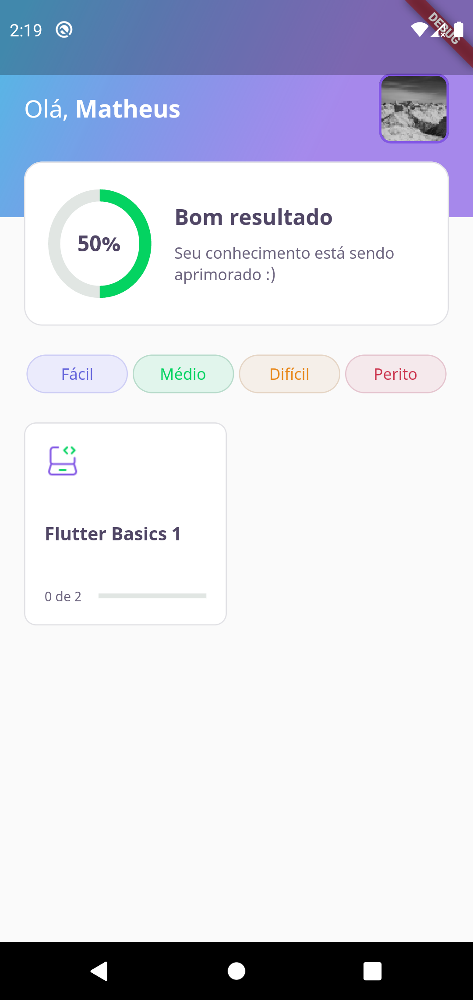

<div align="center">


</div>

## Conteudo

- [Demo](#demo)
- [Sobre](#sobre)
- [Configuração](#configação)

## Sobre

O projeto **Devquiz** foi criado com o intuito de ajudar iniciantes de flutter a aprenderem flutter, de modo geral o aplicativo é um quiz em que o usuario vai aumentando sua pontuação conforme a quantidade de acertos.

Toda a base de dados esta armezenado em um **json** dentro da pasta **assets/database**, lá é possivel customizar o seu usuário e adicionar a suas proprias questões/quizzes.

## Demo



## Configuração

Se é sua primeira vez utilizando o flutter recomendo entrar na pagina [Get started](https://flutter.dev/docs/get-started) em sua documentação oficial, lá contem todas as instruções de instalação e utiliziação para quem ta começando.

Apos realizar as devidas configurações você precisara clonar o projeto com o git.

```bash
git clone git@github.com:mathmorais/NLW5-devquiz.git
```

Em seguida na pasta raiz do projeto você precisara instalar as dependencias utilizadas.

```bash
flutter pub get
```
